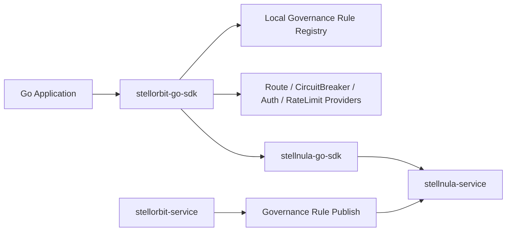

# ADR-0001: 基于 StellNula 配置中心订阅 StellOrbit 服务治理规则

## 状态

已接受，已实施。

## 日期

2026-06-17

## 问题分析

`stellorbit-go-sdk` 是 [`stellhub/stellorbit-service`](https://github.com/stellhub/stellorbit-service) 的 Go 客户端实现，定位应与 `stellorbit-java-sdk` 保持一致：在应用进程内消费服务治理规则，并向接入层提供熔断、限流、鉴权和路由规则 Provider。

StellOrbit 的治理规则不是由 SDK 本地创建或维护。控制面事实源仍然是 `stellorbit-service`，规则经过创建、校验、发布后，会通过 [`stellhub/stellnula-service`](https://github.com/stellhub/stellnula-service) 配置中心下发给数据面客户端。Go SDK 因此不应该继续以同步查询 `stellorbit-service` HTTP API 为主要运行态路径，而应该复用 [`stellhub/stellnula-go-sdk`](https://github.com/stellhub/stellnula-go-sdk) 的 bootstrap、snapshot、watch、listener 和本地快照能力。

治理规则的配置通道固定为：

| 字段 | 值 |
| --- | --- |
| `namespace` | `governance` |
| `group` | `service-governance` |
| `format` | `json` |

控制面发布到 StellNula 的治理规则配置不再是一条规则一个 `configId`。服务端会按应用和治理类型生成固定聚合配置，`configId` 形如 `stellorbit.<applicationCode>.<ruleType>`，例如 `stellorbit.payment-service.route`、`stellorbit.payment-service.rate_limit`。配置内容必须是 `schemaVersion=stellorbit.governance.aggregate.v1` 的聚合 payload，并在 root 上携带用于服务端和客户端校验的 validator payload：路由为 `routes`，限流为 `limit`，熔断为 `breaker`，鉴权为 `auth`。

本 ADR 记录 Go SDK 的第一阶段设计：引入 `stellnula-go-sdk`，订阅 `governance/service-governance`，构建本地不可变规则注册表，并提供最基础的熔断、限流、鉴权和路由规则 Provider。

## 决策

`stellorbit-go-sdk` 将引入 `github.com/stellhub/stellnula-go-sdk` 作为治理规则下发通道。

SDK 初始化时创建一个专用于服务治理规则的 StellNula 客户端：

```go
client, err := stellnula.NewClient(stellnula.Options{
	Endpoint:      options.StellnulaEndpoint,
	GRPCEndpoint:  options.StellnulaGRPCEndpoint,
	APIToken:      options.StellnulaAPIToken,
	AppID:         options.AppID,
	ClientID:      options.ClientID,
	Env:           options.Env,
	Region:        options.Region,
	Zone:          options.Zone,
	Cluster:       options.Cluster,
	Namespace:     "governance",
	Group:         "service-governance",
	WatchEnabled: stellnula.Bool(options.WatchEnabled),
})
```

该客户端负责：

- 启动时执行 bootstrap，同步当前作用域下的治理规则。
- 读取内存快照和本地目录快照。
- 通过 watch/recovery loop 监听规则 revision 变化。
- 通过 listener 将配置变更转换为 SDK 内部规则注册表更新。
- 在远端不可用时使用 last-known-good registry 或本地快照继续提供规则查询。

核心 SDK 只提供规则消费、规则匹配和 Provider，不在核心模块内实现具体熔断状态机、限流算法、鉴权拦截器或路由执行器。

## 设计

### 架构边界



职责边界如下：

| 组件 | 职责 |
| --- | --- |
| `stellorbit-service` | 治理规则控制面，负责规则创建、校验、编译和发布 |
| `stellnula-service` | 配置中心，负责规则版本、快照、订阅、watch 和下发 |
| `stellnula-go-sdk` | Go 配置中心客户端，负责 bootstrap、snapshot、watch、listener 和本地缓存 |
| `stellorbit-go-sdk` | 服务治理规则消费者，负责解析、缓存、匹配和暴露 Provider |
| 应用或框架适配层 | 执行熔断、限流、鉴权、路由等具体动作 |

### 规则通道

第一阶段 SDK 只订阅 `namespace=governance`、`group=service-governance` 下的配置。默认订阅整个 group，后续如果规则规模变大，可再按服务名、`configId` 或订阅前缀收敛。

StellNula 配置条目和 StellOrbit 规则语义的映射如下：

| StellNula 字段 | StellOrbit 语义 |
| --- | --- |
| `ConfigID` | 固定聚合配置 ID，例如 `stellorbit.<applicationCode>.<ruleType>` |
| `ConfigKey` | 聚合配置 key，通常与 `ConfigID` 一致 |
| `ConfigEntry.ConfigValue()` | 聚合治理规则 JSON payload |
| `ContentType` | 内容类型，当前按 JSON 解析 |
| `Revision` | 聚合配置版本 |
| `Snapshot.Revision` | 当前规则集合水位 |
| `Snapshot.Checksum` | 当前规则集合一致性校验 |
| `Scope` | 规则命中的环境、区域、可用区和集群 |

聚合 payload 中的 `rules[].ruleId` 才是 SDK 内部 `RuleID`。聚合配置的 `ConfigID` 会进入 SDK 内部规则的 `ConfigKey`，用于热更新时按配置桶成组替换、回退或删除规则。

SDK 不直接操作 StellNula 数据库表，也不直接调用控制面管理接口轮询规则。控制面 API 只属于管理端、发布流程或测试工具。

### Go API 形态

核心 SDK 后续应围绕一个可关闭的客户端提供能力：

```go
type Client struct {
	// internal fields
}

func NewClient(options Options, opts ...Option) (*Client, error)
func (c *Client) Start(ctx context.Context) error
func (c *Client) Close() error
func (c *Client) Rules() GovernanceRuleRegistry
func (c *Client) Routes() RouteRuleProvider
func (c *Client) CircuitBreakers() CircuitBreakerRuleProvider
func (c *Client) Authorizations() AuthorizationRuleProvider
func (c *Client) RateLimits() RateLimitRuleProvider
```

`Start(ctx)` 负责启动 StellNula 客户端、同步远端规则、注册 listener，并构建首个本地 registry。所有涉及远端 IO 的方法必须接收并传播 `context.Context`。

### Options

后续 `Options` 应补齐治理规则配置：

| 字段 | 默认值 | 说明 |
| --- | --- | --- |
| `StellnulaEndpoint` | 无 | `stellnula-service` HTTP 地址，必填 |
| `StellnulaGRPCEndpoint` | 服务端返回或空 | 可选 gRPC watch 地址 |
| `StellnulaAPIToken` | 空 | 配置中心访问令牌 |
| `AppID` | 应用名 | 当前应用标识 |
| `ClientID` | 自动生成 | 当前进程实例标识 |
| `Env` | `dev` | 环境 |
| `Region` | `default` | 区域 |
| `Zone` | `default` | 可用区 |
| `Cluster` | `default` | 集群 |
| `RuleNamespace` | `governance` | 治理规则 namespace |
| `RuleGroup` | `service-governance` | 治理规则 group |
| `WatchEnabled` | `true` | 是否开启 watch/recovery loop |
| `SnapshotDirectory` | StellNula 默认目录 | 本地快照目录 |

`RuleNamespace` 和 `RuleGroup` 可以保留为可配置项，方便测试和本地实验；生产默认值必须与控制面保持一致。

### 本地规则模型

SDK 内部需要统一的规则 envelope：

```go
type GovernanceRule struct {
	RuleID        string
	RuleName      string
	ConfigKey     string
	RuleType      GovernanceRuleType
	TargetService string
	Status        GovernanceRuleStatus
	Priority      int
	Revision      int64
	Checksum      string
	RawContent    string
	Content       map[string]any
}
```

规则类型第一阶段至少覆盖：

- `CIRCUIT_BREAKER`
- `RATE_LIMIT`
- `AUTH`
- `ROUTE`

状态至少覆盖：

- `DRAFT`
- `ACTIVE`
- `DISABLED`
- `DELETED`

解析器应假设服务端已经完成语义校验，但仍要做客户端防御性校验。无效聚合配置不能污染最后一次可用 registry。

### 规则注册表

本地 registry 应是不可变视图，使用 `atomic.Value` 或 `atomic.Pointer` 做整体替换：

```go
type GovernanceRuleRegistry struct {
	Revision int64
	Checksum string
	Rules    []GovernanceRule
}
```

规则查询顺序与 Java SDK 对齐：

1. 只返回 `ACTIVE` 规则。
2. 按 `RuleType` 过滤。
3. 按 `TargetService` 匹配，支持 `*` 表示全局规则。
4. 按请求属性匹配条件。
5. 输出按 `Priority` 升序、`Revision` 降序、`RuleID` 升序排序。

### Provider 语义

核心 SDK 提供四类 Provider：

```go
type RouteRuleProvider interface {
	Find(ctx context.Context, query RouteRuleQuery) ([]GovernanceRule, error)
	First(ctx context.Context, query RouteRuleQuery) (GovernanceRule, bool, error)
}

type CircuitBreakerRuleProvider interface {
	Find(ctx context.Context, query CircuitBreakerRuleQuery) ([]GovernanceRule, error)
	First(ctx context.Context, query CircuitBreakerRuleQuery) (GovernanceRule, bool, error)
}

type AuthorizationRuleProvider interface {
	Find(ctx context.Context, query AuthorizationRuleQuery) ([]GovernanceRule, error)
	First(ctx context.Context, query AuthorizationRuleQuery) (GovernanceRule, bool, error)
}

type RateLimitRuleProvider interface {
	Find(ctx context.Context, query RateLimitRuleQuery) ([]GovernanceRule, error)
	First(ctx context.Context, query RateLimitRuleQuery) (GovernanceRule, bool, error)
}
```

Provider 只返回匹配规则，不执行最终治理动作：

| Provider | 返回内容 | 不负责 |
| --- | --- | --- |
| `RouteRuleProvider` | 路由、灰度、权重、重试、超时等规则 | 实例选择、负载均衡、HTTP/RPC 拦截 |
| `CircuitBreakerRuleProvider` | 熔断、降级、慢调用和失败率规则 | 熔断状态机、滑动窗口统计、异常分类 |
| `AuthorizationRuleProvider` | 请求认证、授权、访问控制规则 | JWT 校验、mTLS 握手、拦截器拒绝响应 |
| `RateLimitRuleProvider` | 本地或分布式限流规则 | token bucket、固定窗口、配额同步、429 响应 |

### 热更新流程

启动流程：

1. 创建 `stellnula.Client`。
2. 调用 `Start(ctx)` 加载本地快照、执行远端 bootstrap，并启动 watch/recovery loop。
3. 从 `Snapshot()` 读取当前配置条目。
4. 解析 `governance/service-governance` 下的聚合规则 JSON。
5. 构建不可变 `GovernanceRuleRegistry`。
6. 注册 `Listen(...)`，监听后续变更。

变更流程：

1. StellNula watch 或 recovery 得到新 snapshot 或配置 diff。
2. listener 读取 `CurrentSnapshot`。
3. 解析新增、更新和删除的规则。
4. 校验通过后构建新的 registry。
5. 使用原子替换更新本地 registry。

失败策略：

- 单个聚合配置解析失败：记录错误，保留该聚合配置上一版可用规则。
- 整批快照不可解析：保留上一版完整 registry。
- 启动时远端不可用但有本地快照：使用本地快照启动，客户端状态可标记为 degraded。
- 启动时远端不可用且无本地快照：默认 fail-open，返回空规则集并记录 warn；后续可通过配置支持 fail-fast。
- 鉴权规则曾成功加载后更新失败：继续使用上一版鉴权规则，避免异常更新导致安全策略被绕过。

### 聚合规则 JSON 协议

Go SDK 直接采用新版聚合规则协议，不向前兼容旧的单规则 payload。每个配置项必须满足：

- root `schemaVersion` 必须等于 `stellorbit.governance.aggregate.v1`。
- root `configId` 必须等于 StellNula entry 的 `ConfigID`。
- root `ruleType` 必须是 SDK 支持的 StellNula 治理类型。
- root 必须包含当前类型对应的 validator payload：`ROUTE.routes`、`RATE_LIMIT.limit`、`CIRCUIT_BREAKER.breaker`、`AUTH.auth`。
- root `rules` 必须是数组，数组元素的 `content` 必须是对象。
- `rules[].ruleId` 是 SDK 规则 ID，`rules[].configId` 必须与 root `configId` 一致。

解析规则时，SDK 会将 `rules[].content` 与聚合元数据合并，注入 `ruleType`、`sourceRuleType`、`targetService`、`status`、`priority`、`ruleCode`、`schemaVersion`、`aggregateConfigId` 和 `aggregateChecksum` 等字段，并保留合并后的 `RawContent` 方便排障。日志输出必须避免泄漏鉴权密钥、证书、token、JWKS 私钥或敏感 header。

## 影响

### 正向影响

- Go SDK 与 Java SDK 的定位和能力边界一致。
- SDK 复用 StellNula 的 bootstrap、snapshot、revision、checksum、watch 和本地快照机制，减少重复协议实现。
- 运行态读取本地 registry，不需要每次请求同步访问 `stellorbit-service`。
- 后续 Go HTTP middleware、gRPC interceptor、网关适配层可以统一复用 Provider。

### 代价

- `stellorbit-go-sdk` 将新增对 `stellnula-go-sdk` 的依赖及其传递依赖。
- SDK 需要严格跟随服务端聚合规则 JSON 协议演进。
- 本地快照可能包含鉴权、路由或安全材料，需要明确目录权限和日志脱敏策略。
- 规则 Provider 与真正执行器分离后，接入方需要额外适配 HTTP、gRPC 或框架中间件。

## 实施计划

1. 在 `go.mod` 中引入 `github.com/stellhub/stellnula-go-sdk`。
2. 扩展 `Options`，加入 StellNula endpoint、token、作用域、watch 和 snapshot 配置。
3. 新增 `governance` 或 `rule` 包，定义 `GovernanceRule`、`GovernanceRuleType`、`GovernanceRuleStatus`、查询模型和 registry。
4. 新增 `StellnulaGovernanceRuleSource`，封装 `stellnula.Client` 生命周期、启动同步、snapshot 解析和 listener 注册。
5. 新增聚合规则 parser，支持 `CIRCUIT_BREAKER`、`RATE_LIMIT`、`AUTH`、`ROUTE`。
6. 新增四类 Provider，并挂到 `Client` 上暴露。
7. 增加单元测试覆盖启动同步、空规则、规则排序、属性匹配、删除规则、解析失败、last-known-good 和本地快照 fallback。

## 非目标

- 不在 Go SDK 中实现 `stellorbit-service` 或 `stellnula-service` 的服务端能力。
- 不直接操作 StellNula 数据库表。
- 不通过轮询控制面管理接口替代配置中心 watch。
- 不在第一阶段实现规则创建、更新、删除等控制面 API。
- 不在核心 SDK 中实现熔断状态机、限流算法、鉴权拦截器、路由执行器、负载均衡器或框架自动装配。
- 不在核心 SDK 中强绑定某个 Go Web 框架。

## 验证

后续实现完成后至少需要验证：

- `go test ./...` 通过。
- 启动 SDK 时 StellNula options 使用 `Namespace=governance`、`Group=service-governance`。
- 已发布聚合规则能在启动同步后进入本地 registry。
- 规则更新后 listener 能触发 registry 原子替换。
- 聚合配置删除后 registry 中对应规则消失。
- 单个聚合配置解析失败时不会破坏 last-known-good registry。
- StellNula 不可用时可按配置使用本地快照或 fail-fast。

## 参考

- [stellhub/stellorbit-service](https://github.com/stellhub/stellorbit-service)
- [stellhub/stellnula-service](https://github.com/stellhub/stellnula-service)
- [stellhub/stellnula-go-sdk](https://github.com/stellhub/stellnula-go-sdk)
- [stellhub/stellorbit-java-sdk](https://github.com/stellhub/stellorbit-java-sdk)
